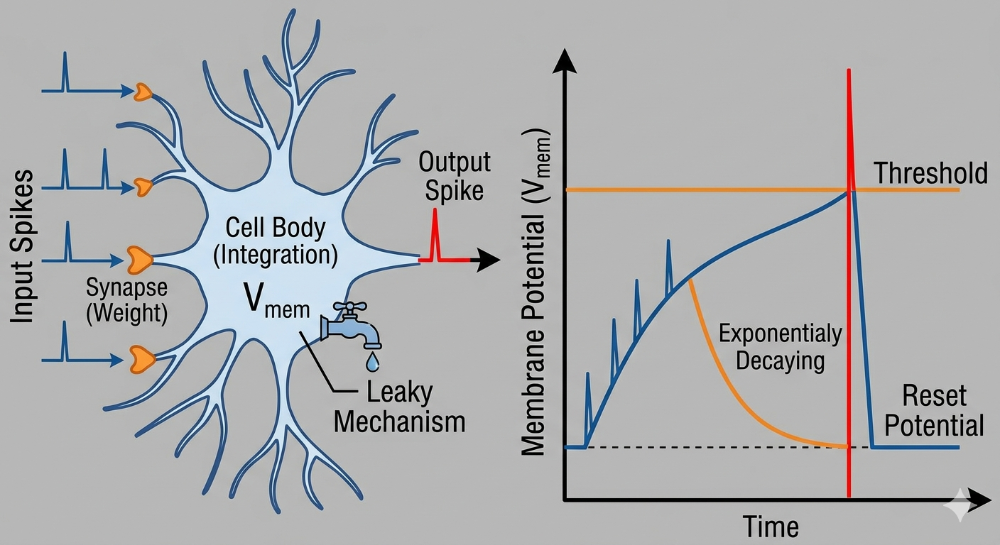
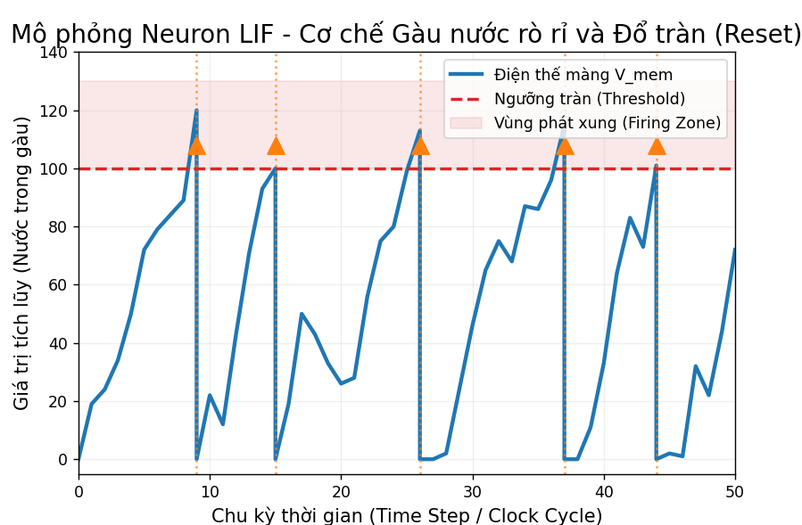
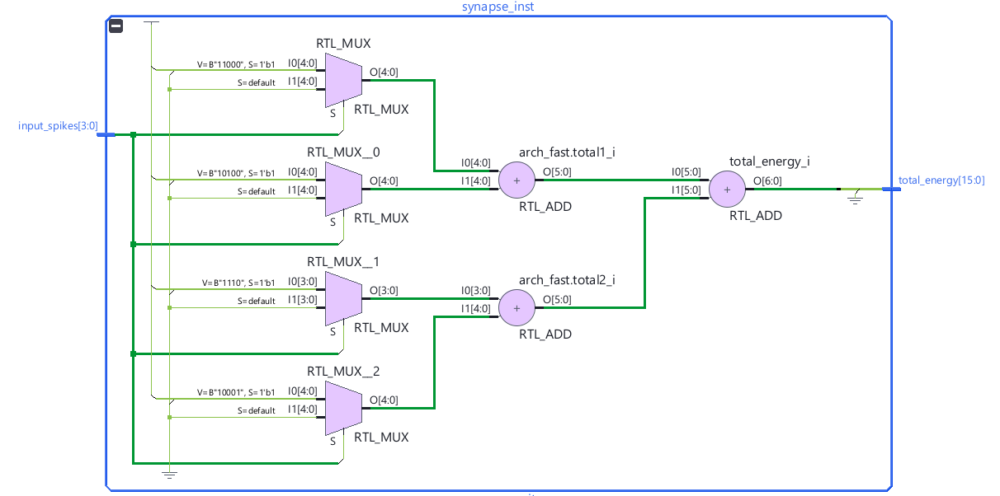
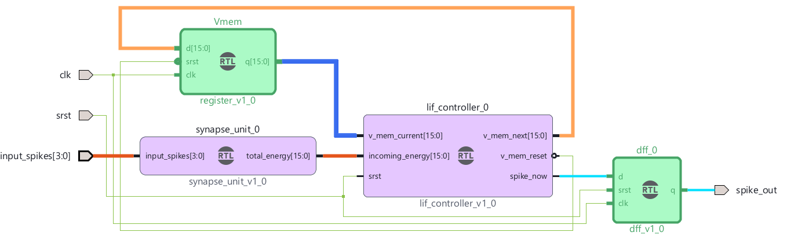

# FPGA DEVELOPMENT KITS

<!-- TOC -->

- [Công cụ phát triển](#c%C3%B4ng-c%E1%BB%A5-ph%C3%A1t-tri%E1%BB%83n)
- [Các Dev Kit liên quan](#c%C3%A1c-dev-kit-li%C3%AAn-quan)
- [Kria KV260 Vision AI Starter Kit](#kria-kv260-vision-ai-starter-kit)
- [Kria KR260 Robotics Starter Kit](#kria-kr260-robotics-starter-kit)
- [Các dự án](#c%C3%A1c-d%E1%BB%B1-%C3%A1n)
    - [LedOn](#ledon)
    - [LedSwitch](#ledswitch)
    - [Dự án 1: "Trái tim" của SNN – Neuron LIF đơn lẻ](#d%E1%BB%B1-%C3%A1n-1-tr%C3%A1i-tim-c%E1%BB%A7a-snn--neuron-lif-%C4%91%C6%A1n-l%E1%BA%BB)
        - [Mô hình Toán học và Sinh học của Neuron LIF](#m%C3%B4-h%C3%ACnh-to%C3%A1n-h%E1%BB%8Dc-v%C3%A0-sinh-h%E1%BB%8Dc-c%E1%BB%A7a-neuron-lif)
        - [Mô hình Sinh học của Neuron LIF](#m%C3%B4-h%C3%ACnh-sinh-h%E1%BB%8Dc-c%E1%BB%A7a-neuron-lif)
        - [Mô hình Software Programming](#m%C3%B4-h%C3%ACnh-software-programming)
        - [Mô hình Hardware Design](#m%C3%B4-h%C3%ACnh-hardware-design)
    - [Dự án 2: Mã hóa thông tin Spike Encoding](#d%E1%BB%B1-%C3%A1n-2-m%C3%A3-h%C3%B3a-th%C3%B4ng-tin-spike-encoding)
    - [Dự án 3: Khớp thần kinh The Synapse – Tích hợp trọng số](#d%E1%BB%B1-%C3%A1n-3-kh%E1%BB%9Bp-th%E1%BA%A7n-kinh-the-synapse--t%C3%ADch-h%E1%BB%A3p-tr%E1%BB%8Dng-s%E1%BB%91)
    - [Dự án 4: Lớp ẩn đầu tiên Single Layer SNN](#d%E1%BB%B1-%C3%A1n-4-l%E1%BB%9Bp-%E1%BA%A9n-%C4%91%E1%BA%A7u-ti%C3%AAn-single-layer-snn)
    - [Dự án 5: Học máy thực thụ – MNIST Classifier](#d%E1%BB%B1-%C3%A1n-5-h%E1%BB%8Dc-m%C3%A1y-th%E1%BB%B1c-th%E1%BB%A5--mnist-classifier)

<!-- /TOC -->

## Công cụ phát triển

[Xem tài liệu Vitis HLS + Vivado](./Vivado.md)

## Các Dev Kit liên quan

| Dev Kit                                                               | Price | Homepage                                                                                            |
| --------------------------------------------------------------------- | ----- | --------------------------------------------------------------------------------------------------- |
| [TUL PYNQ-Z2](./TUL_PYNQ-Z2.md)                                       | 7tr   | <https://www.tulembedded.com/FPGA/ProductsPYNQ-Z2.html>                                             |
| [Kria KV260 Vision AI Starter Kit](#kria-kv260-vision-ai-starter-kit) | 13tr  | <https://pivietnam.com.vn/xilinx-kria-kv260-vision-ai-starter-kit-sk-kv260-g-pivietnam-com-vn.html> |
| [Kria KR260 Robotics Starter Kit](#kria-kr260-robotics-starter-kit)   | .     | .                                                                                                   |

## Kria KV260 Vision AI Starter Kit

- Logic Cells: ~256K (Gấp 5 lần PYNQ-Z2).
- DSP Slices: 1,248 (Gấp gần 6 lần). Đây là thông số cực kỳ quan trọng để chạy các mạng neuron lớn như YOLOv8 hay ResNet-50.
- CPU cứng: 4 nhân ARM Cortex-A53 (64-bit) cực mạnh, giúp chạy Linux và Python mượt mà hơn hẳn nhân ARM A9 cũ.
- Hỗ trợ AI: Tích hợp sẵn Vitis AI và các "AI Box" có sẵn, bạn chỉ cần nạp model là chạy
- Chiu được 128 nhân RV32
- Vua của Thị giác máy tính
- Xilinx cung cấp các "Vision Apps" chạy sẵn (Smart Camera, AI Box). Nếu bạn làm mạng neuron nhận diện vật thể, khuôn mặt, đây là lựa chọn số 1.
- [Mua sắm](https://mlab.vn/3759721-xilinx-kria-kv260-vision-ai-starter-kit-sk-kv260-g.html)

## Kria KR260 Robotics Starter Kit

- Phù hợp cho SNN
- Bạn sẽ không dùng Vitis AI (vì Vitis AI tối ưu cho CNN/DDR). Thay vào đó, bạn sẽ dùng:
  SNN Library: Sử dụng các framework như SNNilink hoặc BindsNET để huấn luyện mô hình trên máy tính.
  HLS Implementation: Viết mô hình SNN bằng C++ (Vitis HLS) để nạp vào FPGA của KR260.
  Python Interface:
- [Mua sắm](https://www.proe.vn/kria-kr260-robotics-starter-kit)

## Các dự án

### LedOn

Helloword với một khối **FPGA chỉ nối dây đồng với đèn led đơn**, và sử dụng **python** chạy trên **ARM core** để triệu gọi khối FPGA đó qua **AXI4**

### LedSwitch

Hai khối FPGA:

- **FPGA chỉ nối dây đồng với đèn led RGB** và sử dụng **python** chạy trên **ARM core** để triệu gọi khối FPGA đó qua **AXI4** với dải màu long lanh.
- **FPGA điều khiển led đơn qua công tắc switch**, độc lâp hoàn toàn với **ARM core**.

---

### Dự án 1: "Trái tim" của SNN – Neuron LIF đơn lẻ

Xây dựng một **Leaky Integrate-and-Fire (LIF)** neuron đơn lẻ

- **Mục tiêu**: Hiểu cơ chế tích lũy điện thế màng (Vmem) và cơ chế rò rỉ (leak).
- **Input**: Một tín hiệu input_spike (1-bit).
- **Output**: Một tín hiệu output_spike (1-bit).
- **Thử thách Verilog**: Sử dụng số Fixed-point để tính toán Vmem. Khi Vmem vượt ngưỡng threshold, kích hoạt output_spike và reset Vmem.
- **Kiểm tra trên PYNQ**: Dùng Python gửi các chuỗi xung nhanh/chậm khác nhau và quan sát LED trên board nháy theo tần số tương ứng.

#### Mô hình Toán học và Sinh học của Neuron LIF

Ảnh sau thể hiện một Neuron LIF (Leaky Integrate-and-Fire) hoạt động dựa trên điện thế màng Vmem:

$$V_{mem}(t) = V_{mem}(t-1) + \sum_{i=1}^{n} (Spike_i \times Weight_i) - Leak$$

#### Mô hình Sinh học của Neuron LIF

- Bên trái ảnh là Mô hình sinh học: Tín hiệu đầu vào **Spikes** đi qua khớp thần kinh **Synapse** với trọng số **w** được tích lũy vào thân neuron. Nó có một cơ chế "rò rỉ" điện thế ra môi trường.
- Bên phải ảnh là đồ thị điện thế: đường cong Vmem đi lên khi có xung vào. Nếu không có xung, nó tự rò rỉ đi xuống (Leaky). Khi chạm vạch ngưỡng **Threshold**, nó phát ra một xung đầu ra (**Spike**) và lập tức **Reset** điện thế về 0.
  \
  Nguồn Gemini

#### Mô hình Software Programming

- Đây là **thuật toán leaky bucket**, là một dạng thuật toán điều khiển luồng, nhưng thay vì lấy dòng rò rỉ là đầu ra chính, thì nó lại dùng ngưỡng tràn là đầu ra chính.
- Một số neuron có **tốc độ rò rỉ nhanh**, đóng vai trò như bộ lọc nhiễu, nên chỉ phản ứng với các tín hiệu đến cực dồn dập. **tốc độ rò rỉ chậm** thì giống bộ nhớ dài hạn,
- Một số neuron có **ngưỡng threashold thấp**, chứng tỏ chúng cực kỳ nhạy cảm, dễ dàng phát hỏa chỉ với một vài tác động nhỏ. **ngưỡng threashold cao** chứng tỏ chúng rất điềm tĩnh, vô vi.

```python
import matplotlib.pyplot as plt
import random
import numpy as np

# --- 1. CẤU HÌNH THÔNG SỐ (Bộ giá trị thấp để dễ nhìn) ---
threshold = 100        # Ngưỡng phát xung
leak = 10              # Lượng rò rỉ mỗi chu kỳ
v_mem = 0              # Điện thế màng khởi tạo
weights = [12, 9, 17, 3] # Trọng số của 4 nguồn vào
time_steps = 50        # Giảm số chu kỳ để đồ thị thoáng hơn

# --- 2. KHỞI TẠO LỊCH SỬ ---
# Chúng ta sẽ lưu lịch sử theo cách "vẽ đường liên tục" (zigzag)
# bao gồm cả điểm Vmem vượt ngưỡng và điểm Reset về 0.
time_history = []
v_history = []
spike_times = []  # Lưu thời điểm bắn xung để vẽ dấu gạch

print(f"Bắt đầu mô phỏng Gàu nước LIF (Threshold: {threshold}, Leak: {leak})")
print("-" * 65)

# Đặt giá trị ban đầu vào lịch sử
current_time = 0
time_history.append(current_time)
v_history.append(v_mem)

# --- 3. MÔ PHỎNG ---
for t in range(1, time_steps + 1):
    # 3.1. Giả lập xung đầu vào (random)
    input_spikes = [random.choice([0, 1]) for _ in range(len(weights))]

    # 3.2. Tính năng lượng vào: sum(Spike_i * Weight_i)
    # Tư duy logic: (1*24) + (0*20) + (1*14) + (0*17)
    incoming_energy = sum(s * w for s, w in zip(input_spikes, weights))

    # 3.3. Tích lũy và Rò rỉ: V(t) = V(t-1) + Energy - Leak
    new_v_mem = v_mem + incoming_energy - leak

    # Đảm bảo Vmem không âm
    if new_v_mem < 0:
        new_v_mem = 0

    # --- 3.4. XỬ LÝ ĐIỂM "GÀU NƯỚC ĐỔ NGHIÊNG" ---
    if new_v_mem >= threshold:
        # Giai đoạn A: "Gàu đầy" - Nước dâng lên vượt ngưỡng
        current_time += 1.0  # Tăng thời gian
        time_history.append(current_time)
        v_history.append(new_v_mem) # <--- Vẽ điểm vượt ngưỡng
        spike_times.append(current_time) # Lưu thời điểm bắn xung

        # Giai đoạn B: "Đổ nước" - Thụt thẳng về 0 (Vertical reset)
        # Giả lập thời gian đổ nước cực ngắn (0.01) để đường thẳng đứng
        # current_time += 0.01  # Tăng thời gian cực nhỏ
        time_history.append(current_time) # <--- Thời gian giữ nguyên
        v_history.append(0)         # <--- Giá trị rơi về 0

        # Cập nhật giá trị Vmem thực tế về 0 cho chu kỳ sau
        v_mem = 0
        spike_str = "FIRE! 🚀"

    else:
        # Giai đoạn C: "Dâng nước thường" - Không chạm ngưỡng
        v_mem = new_v_mem
        current_time += 1.0
        time_history.append(current_time)
        v_history.append(v_mem)
        spike_str = "."

    # --- HIỂN THỊ KẾT QUẢ ---
    print(f"T={t:2} | Input Spikes: {input_spikes} | Energy: +{incoming_energy:<3} | V_mem (Peak): {v_mem:3} | {spike_str}")

print("-" * 65)

# --- 4. VẼ ĐỒ THỊ ---
plt.figure(figsize=(14, 7))

# Vẽ đường điện thế màng V_mem (zigzag liên tục)
plt.plot(time_history, v_history, color='#1f77b4', linewidth=2.5, label="Điện thế màng V_mem")

# Vẽ đường ngưỡng (Threshold)
plt.axhline(y=threshold, color='#d62728', linestyle='--', linewidth=2, label="Ngưỡng tràn (Threshold)")

# Vẽ vùng Reset (màu đỏ mờ sau Threshold)
plt.axhspan(threshold, max(v_history) + 10, color='#d62728', alpha=0.1, label="Vùng phát xung (Firing Zone)")

# Vẽ các vạch đứng biểu thị thời điểm bắn xung (Spike trains)
for st in spike_times:
    plt.axvline(x=st, color='#ff7f0e', linestyle=':', alpha=0.7, linewidth=1.5)
    # Vẽ mũi tên orange khi bắn xung
    plt.scatter(st, threshold + 8, color='#ff7f0e', marker='^', s=120, zorder=5)

# Tùy chỉnh đồ thị
plt.title("Mô phỏng Neuron LIF - Cơ chế Gàu nước rò rỉ và Đổ tràn (Reset)", fontsize=16)
plt.xlabel("Chu kỳ thời gian (Time Step / Clock Cycle)", fontsize=12)
plt.ylabel("Giá trị tích lũy (Nước trong gàu)", fontsize=12)
plt.xlim(0, max(time_history))
plt.ylim(-5, max(v_history) + 20)
plt.grid(True, which='both', linestyle='-', alpha=0.2)
plt.legend(loc='upper right', fontsize=10)

plt.tight_layout()
plt.show()
```



#### Mô hình Hardware Design

- Sẽ một mạch dãy sequential logic với cac xung clock. 
- **Cơ chế tích lũy**: Vmem là một thanh ghi, kết hợp với bộ cộng nhưng với rất nhiều đầu vào tương ứng với các **Spike đầu vào** và Leak.
- **Cơ chế tích lũy**: Thiết kế một thanh ghi ngưỡng **Vthreshhold**, dùng và dùng bộ so sánh để xác định thượt ngưỡng để tạo ra xung **Spike đầu ra**
- **Cơ chế xóa tích lũy**  Tin hiệu **Spike đầu ra** vòng trở lại vào chân **reset** của thanh ghi **Vmem**.

**Các bước thiết kế:**

- Bước 1: Mã nguồn [lif_neuron.v1.v](./SNN-images/lif_neuron.v1.v) cho thấy cách thiết kế **chỉ cần chạy được**, với sự giúp đỡ của AI, kết hợp với mã nguồn khớp thần kinh để tính tổng năng lượng đầu vào [synapse_unit.v](./SNN-images/synapse_unit.v).
  
- Bước 2: Mã nguồn [lif_neuron.v2.v](./SNN-images/lif_neuron.v2.v) cho thấy cách thiết kế **phân rã module, hiệu suất cao, rõ ràng vởi phần mạch tổ hợp và thanh ghi tách biệt**.
- Bước 3: Kết hợp với phân tích RTL để **trực quan hóa và kiểm soát** bằng thiết kế dạng **block design**. 


### Dự án 2: Mã hóa thông tin (Spike Encoding)

SNN không hiểu con số 0.75, nó chỉ hiểu xung. Bạn cần một bộ chuyển đổi.

- **Mục tiêu**: Chuyển đổi giá trị số từ Python thành chuỗi xung (Rate Coding).
- **Thử thách Verilog**: Xây dựng một module nhận số 8-bit từ AXI-Lite và so sánh nó với một bộ đếm số ngẫu nhiên (LFSR - Linear Feedback Shift Register). Nếu số ngẫu nhiên < giá trị đầu vào, phát ra 1 xung.
- **Kiểm tra trên PYNQ**: Gửi số 255 (LED sáng rực - xung dày đặc) và số 10 (LED nháy cực chậm).

### Dự án 3: Khớp thần kinh (The Synapse) – Tích hợp trọng số

Neuron chỉ mạnh khi có sự kết nối với các trọng số (Weights).

- **Mục tiêu**: Nhân xung đầu vào với một trọng số trước khi đưa vào Neuron.
- **Thử thách Verilog**: Vì xung chỉ là 0 hoặc 1, phép nhân thực chất là: Nếu có xung, thì cộng Weight vào Vmem; nếu không có xung, thì không cộng. Đây là lý do SNN cực kỳ tiết kiệm năng lượng trên FPGA (không cần bộ nhân DSP cồng kềnh).
- **Kiểm tra trên PYNQ**: Dùng Python thay đổi Weight qua AXI. Với cùng một đầu vào, xem Weight lớn làm Neuron "bắn" xung nhanh hơn thế nào.

### Dự án 4: Lớp ẩn đầu tiên (Single Layer SNN)

Kết nối nhiều Neuron lại thành một lớp (Layer).

- **Mục tiêu**: Xây dựng một lớp gồm 8 Neuron song song nhận chung một nguồn xung nhưng có trọng số khác nhau.
- **Thử thách Verilog**: Quản lý tài nguyên. Liệu bạn sẽ tạo ra 8 module Neuron riêng biệt (Song song hoàn toàn) hay dùng 1 module Neuron và dùng RAM để lưu trạng thái của 8 Neuron (Quét vòng - Time-multiplexing)?
- **Kiểm tra trên PYNQ**: Hiển thị trạng thái của 8 Neuron lên 8 LED đơn trên PYNQ-Z2.

### Dự án 5: Học máy thực thụ – MNIST Classifier

Đây là dự án "Tốt nghiệp" giai đoạn cơ bản.

- **Mục tiêu**: Nhận diện chữ số viết tay (0-9) từ tập dữ liệu MNIST.
- **Lộ trình thực hiện**:
  1. Dùng snnTorch (Python) trên máy tính để huấn luyện một mạng SNN nhỏ (ví dụ: 784 đầu vào -> 32 lớp ẩn -> 10 đầu ra).
  2. Xuất các trọng số đã huấn luyện ra file .bin.
  3. Thiết kế bộ nạp trọng số từ Python xuống BRAM của FPGA.
  4. Đẩy ảnh từ Jupyter Notebook xuống và xem FPGA đoán số mấy.
