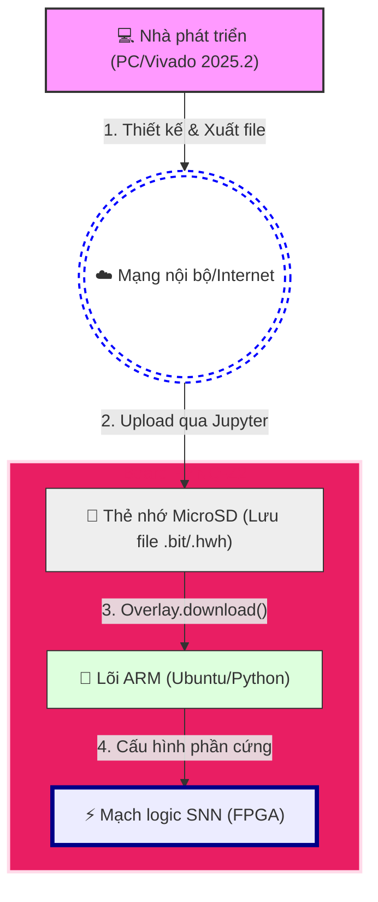
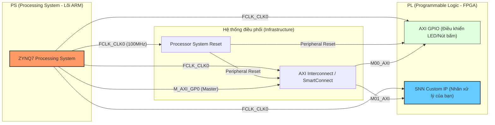

# PYNQ-Z2 Setup Guide

**PYNQ** là viết tắt của **P**ython productivity for **Zynq**

<!-- TOC -->

- [Tài liệu](#t%C3%A0i-li%E1%BB%87u)
- [Mối quan hệ trong SoC và quá trình phát triển](#m%E1%BB%91i-quan-h%E1%BB%87-trong-soc-v%C3%A0-qu%C3%A1-tr%C3%ACnh-ph%C3%A1t-tri%E1%BB%83n)
- [OS Image mặc định cho lõi ARM](#os-image-m%E1%BA%B7c-%C4%91%E1%BB%8Bnh-cho-l%C3%B5i-arm)
- [Sử dụng và phát triển các Ứng dụng trên ARM core](#s%E1%BB%AD-d%E1%BB%A5ng-v%C3%A0-ph%C3%A1t-tri%E1%BB%83n-c%C3%A1c-%E1%BB%A8ng-d%E1%BB%A5ng-tr%C3%AAn-arm-core)
- [Sử dụng và phát triển các bộ Accelerator trên FPGA core](#s%E1%BB%AD-d%E1%BB%A5ng-v%C3%A0-ph%C3%A1t-tri%E1%BB%83n-c%C3%A1c-b%E1%BB%99-accelerator-tr%C3%AAn-fpga-core)
    - [Tạo dự án trên Vivado](#t%E1%BA%A1o-d%E1%BB%B1-%C3%A1n-tr%C3%AAn-vivado)
    - [TUL PYNQ-Z2 / Bắt đầu xây dựng mạng SNN trong Vivado](#tul-pynq-z2--b%E1%BA%AFt-%C4%91%E1%BA%A7u-x%C3%A2y-d%E1%BB%B1ng-m%E1%BA%A1ng-snn-trong-vivado)

<!-- /TOC -->

## Tài liệu

- <https://mlab.com.vn/tul-pynq-z2-board-xilinx-zynq-xc7z020-fpga-1m1-m000127dev>
- Chỉ chịu được 1,2 nhân như RV32I
- Đối tượng: Sinh viên, người mới bắt đầu.
- Ưu điểm: Rẻ, dễ dùng với Python, có sẵn cổng HDMI/Audio để làm đồ án.
- Nhược điểm: Yếu, không thể chạy các mô hình AI hiện đại như BERT, GPT hay YOLOv8 tốc độ cao.
- Cấu hình:
  - 650MHz dual-core Cortex-A9 processor
  - DDR3 với 8 kênh DMA, 4 cổng High Performance AXI3 Slave Port
- [PYNQ-Z2 Setup Guide, Video hướng dãn nạp Image](https://pynq.readthedocs.io/en/latest/getting_started/pynq_z2_setup.html)
- [PYNQ Images](https://www.pynq.io/boards.html)
- [PYNQ Z2 Schematic, offline](./TUL_PYNQ-Z2-docs//TUL_PYNQ_Schematic_R12.pdf)
- [PYNQ Ze User guide, offline](./TUL_PYNQ-Z2-docs//pynqz2_user_manual_v1_0.pdf)
- [PYNQ Ze User guide, online](https://dpoauwgwqsy2x.cloudfront.net/Download/pynqz2_user_manual_v1_0.pdf)
- [Mã nguồn](https://pynq.readthedocs.io/en/latest/pynq_package.html)

## Mối quan hệ trong SoC và quá trình phát triển



## OS Image mặc định cho lõi ARM

1. Tải về image của hệ điều hành ubuntu cho lõi ARM [PYNQ Images](https://www.pynq.io/boards.html)
2. Burn image lên SD Card
3. Kết nối trực tiếp kit với địa chỉ IP tĩnh mặc định. [Xem ở đây](https://pynq.readthedocs.io/en/latest/getting_started/pynq_z2_setup.html#connect-to-a-computer)

   ```mermaid
   graph LR
    subgraph Laptop [💻 Laptop Host]
        L1[Cổng LAN]
        L2[Cổng USB]
    end

    subgraph PYNQ_Z2 [📟 PYNQ Z2 Kit]
        Z1[Cổng LAN]
        Z2[Cổng USB]
    end

    %% Kết nối LAN với IP hiển thị rõ ràng
    L1 --- |"192.168.2. <> 192.168.2.99"| Z1
    
    %% Kết nối USB
    L2 --- |"Micro-USB (Serial 115200 /Power)"| Z2

    %% Màu sắc để phân biệt
    style Laptop fill:#e1f5fe,stroke:#01579b,stroke-width:2px
    style PYNQ_Z2 fill:#fff3e0,stroke:#e65100,stroke-width:2px
   ```

   Hoặc kết nối kit qua Router. [Xem chi tiết](https://pynq.readthedocs.io/en/latest/getting_started/pynq_z2_setup.html#connect-to-a-network-router)
4. Khởi động kit.\
   Có thể giám sát qua Serial, 115200, 1stop, 0 parity.\
   Trên serial, sẽ thấy tự động đăng nhập luôn với tài khoản **xilinx**/**xilinx**\
   
5. Kết nối thành công là phải **ping** được, **telnet vào cổng 80, 22**  được.\
   \
   Cũng có thể SSH trực tiếp lên thiét bị:\
   
6. Truy cập vào **Jupiter Notebook** trên kit tại <http://192.168.2.99>. *Thường sẽ được redirect tới cổng khác như 9090*\
   

## Sử dụng và phát triển các Ứng dụng trên ARM core

Từ khóa: Ubuntu OS, python, Web

## Sử dụng và phát triển các bộ Accelerator trên FPGA core

### Tạo dự án trên Vivado

- Mở **Vivado**
- Chọn **Create Project**. Bấm **New**, và sau đó **Next**.\
  
- Đặt tên dự án và thư mục dự án.\
    
- Đừng chọn tab "Parts", hãy chọn tab **Boards**.\
  \
  Chọn board **pynq-z2**. Bấm **Next**.

### TUL PYNQ-Z2 / Bắt đầu xây dựng mạng SNN trong Vivado

*Lưu ý rằng: phần core **ARM** vẫn sử dụng **Ubutu OS image** mặc định đã có, và phải có. Các thao tác bên dưới chỉ tác động lên phàn Zynq XC7000 thôi.*

Khi thiết kế SNN trong Vivado, việc chọn đúng Board File sẽ giúp tính năng **Designer Assistance** sử dụng được.

- Khi kéo thả khối xử lý **Zynq** vào sơ đồ, **Vivado** sẽ tự động hỏi: "Bạn có muốn tôi tự cấu hình RAM và Clock cho PYNQ Z2 không?".
- Bấm **Run Block Automation** thì toàn bộ cấu hình phức tạp sẽ được thiết lập chuẩn ngay.


