# PYNQ-Z2 Setup Guide

**PYNQ** là viết tắt của **P**ython productivity for **Zynq**

<!-- TOC -->

- [Tài liệu](#t%C3%A0i-li%E1%BB%87u)
- [Mối quan hệ trong SoC và quá trình phát triển](#m%E1%BB%91i-quan-h%E1%BB%87-trong-soc-v%C3%A0-qu%C3%A1-tr%C3%ACnh-ph%C3%A1t-tri%E1%BB%83n)
- [OS Image mặc định cho lõi ARM](#os-image-m%E1%BA%B7c-%C4%91%E1%BB%8Bnh-cho-l%C3%B5i-arm)
- [Sử dụng và phát triển các Ứng dụng trên ARM core](#s%E1%BB%AD-d%E1%BB%A5ng-v%C3%A0-ph%C3%A1t-tri%E1%BB%83n-c%C3%A1c-%E1%BB%A8ng-d%E1%BB%A5ng-tr%C3%AAn-arm-core)
- [Sử dụng và phát triển các bộ Accelerator trên FPGA core](#s%E1%BB%AD-d%E1%BB%A5ng-v%C3%A0-ph%C3%A1t-tri%E1%BB%83n-c%C3%A1c-b%E1%BB%99-accelerator-tr%C3%AAn-fpga-core)
- [Board file để tích hợp board PNYQ-Z2 vào Vivado](#board-file-%C4%91%E1%BB%83-t%C3%ADch-h%E1%BB%A3p-board-pnyq-z2-v%C3%A0o-vivado)
    - [Tạo dự án trên Vivado](#t%E1%BA%A1o-d%E1%BB%B1-%C3%A1n-tr%C3%AAn-vivado)
    - [Tạo Block Diagram mô tả cấu trúc board PYNQ-Z2](#t%E1%BA%A1o-block-diagram-m%C3%B4-t%E1%BA%A3-c%E1%BA%A5u-tr%C3%BAc-board-pynq-z2)
    - [Chạy chương trình](#ch%E1%BA%A1y-ch%C6%B0%C6%A1ng-tr%C3%ACnh)
- [Examples](#examples)

<!-- /TOC -->

## Tài liệu

- <https://mlab.com.vn/tul-pynq-z2-board-xilinx-zynq-xc7z020-fpga-1m1-m000127dev>
- Chỉ chịu được 1,2 nhân như RV32I
- Đối tượng: Sinh viên, người mới bắt đầu.
- Ưu điểm: Rẻ, dễ dùng với Python, có sẵn cổng HDMI/Audio để làm đồ án.
- Nhược điểm: Yếu, không thể chạy các mô hình AI hiện đại như BERT, GPT hay YOLOv8 tốc độ cao.
- Cấu hình:
  - 650MHz dual-core Cortex-A9 processor
  - DDR3 với 8 kênh DMA, 4 cổng High Performance AXI3 Slave Port
- [PYNQ-Z2 Setup Guide, Video hướng dãn nạp Image](https://pynq.readthedocs.io/en/latest/getting_started/pynq_z2_setup.html)
- [PYNQ Images](https://www.pynq.io/boards.html)
- [PYNQ Z2 Schematic, offline](./TUL_PYNQ-Z2-docs//TUL_PYNQ_Schematic_R12.pdf)
- [PYNQ Ze User guide, offline](./TUL_PYNQ-Z2-docs//pynqz2_user_manual_v1_0.pdf)
- [PYNQ Ze User guide, online](https://dpoauwgwqsy2x.cloudfront.net/Download/pynqz2_user_manual_v1_0.pdf)
- [Tài liệu chi tiết đặc tả và các thư viện, bitstream](https://pynq.readthedocs.io/en/latest/pynq_package.html)
- [Github](https://github.com/xilinx/PYNQ/)

## Mối quan hệ trong SoC và quá trình phát triển


## OS Image mặc định cho lõi ARM

1. Tải về image của hệ điều hành ubuntu cho lõi ARM [PYNQ Images](https://www.pynq.io/boards.html)
2. Burn image lên SD Card
3. Kết nối trực tiếp kit với địa chỉ IP tĩnh mặc định. [Xem ở đây](https://pynq.readthedocs.io/en/latest/getting_started/pynq_z2_setup.html#connect-to-a-computer)

   ```mermaid
   graph LR
    subgraph Laptop [💻 Laptop Host]
        L1[Cổng LAN]
        L2[Cổng USB]
    end

    subgraph PYNQ_Z2 [📟 PYNQ Z2 Kit]
        Z1[Cổng LAN]
        Z2[Cổng USB]
    end

    %% Kết nối LAN với IP hiển thị rõ ràng
    L1 --- |"192.168.2. <> 192.168.2.99"| Z1
    
    %% Kết nối USB
    L2 --- |"Micro-USB (Serial 115200 /Power)"| Z2

    %% Màu sắc để phân biệt
    style Laptop fill:#e1f5fe,stroke:#01579b,stroke-width:2px
    style PYNQ_Z2 fill:#fff3e0,stroke:#e65100,stroke-width:2px
   ```

   Hoặc kết nối kit qua Router. [Xem chi tiết](https://pynq.readthedocs.io/en/latest/getting_started/pynq_z2_setup.html#connect-to-a-network-router)
4. Khởi động kit.\
   Có thể giám sát qua Serial, 115200, 1stop, 0 parity.\
   Trên serial, sẽ thấy tự động đăng nhập luôn với tài khoản **xilinx**/**xilinx**\
   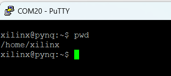
5. Kết nối thành công là phải **ping** được, **telnet vào cổng 80, 22**  được.\
   \
   Cũng có thể SSH trực tiếp lên thiét bị:\
   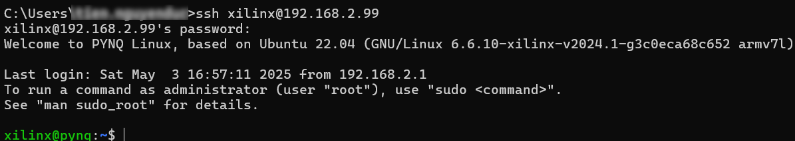
6. Truy cập vào **Jupiter Notebook** trên kit tại <http://192.168.2.99>. *Thường sẽ được redirect tới cổng khác như 9090*\
   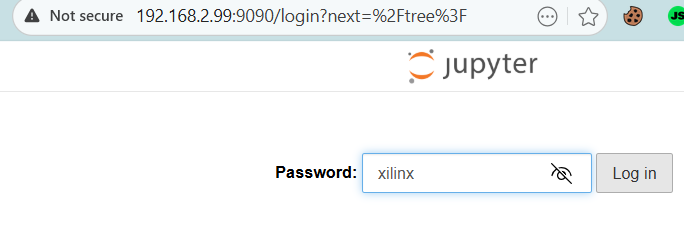

## Sử dụng và phát triển các Ứng dụng trên ARM core

Từ khóa: Ubuntu OS, python, Web

## Sử dụng và phát triển các bộ Accelerator trên FPGA core

## Board file để tích hợp board PNYQ-Z2 vào Vivado

- [online](https://github.com/xupsh/pynq-supported-board-file), 
- [offline](./TUL_PYNQ-Z2-BoardFile/A.0/)

### Tạo dự án trên Vivado

- Mở **Vivado**
- Chọn **Create Project**. Bấm **New**, và sau đó **Next**.\
  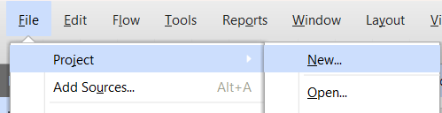
- Đặt tên dự án và thư mục dự án.\
  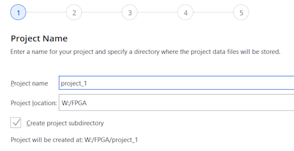  
- Ở cửa sổ **Project Type**, chọn **RTL Project**.\
  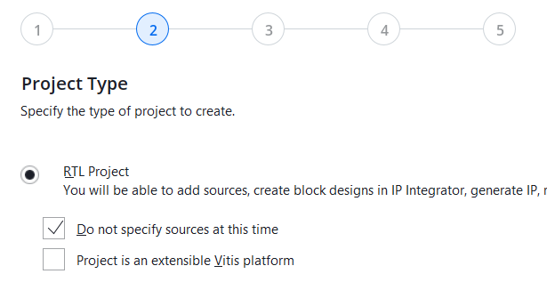
- Đừng chọn tab "Parts", hãy chọn tab **Boards**.\
  Chọn board **pynq-z2**. Bấm **Next**.\
  <span style="color:red"> Lưu ý: Nếu board **pynq-z2** không hiện ra như trong ảnh, tức là board này chưa đặc tả trong Vivado. Xem hướng dẫn [Bổ sung thêm các Dev-Kit board mới](./Vivado.md#bổ-sung-thêm-các-dev-kit-board-mới), và tải về [board file PYNQ-Z2 ở đây](#board-file-để-tích-hợp-board-pnyq-z2-vào-vivado) </span>\
  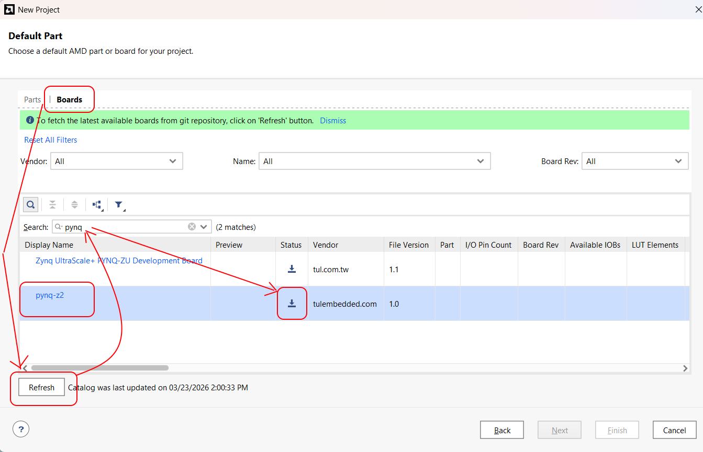\
  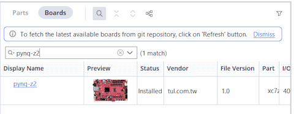
- Chuyển sang trang cuối **New Project Summary**, bấm **Finish**.
- Xem tiếp [Tạo Block Diagram mô tả cấu trúc board PYNQ-Z2](#tạo-block-diagram-mô-tả-cấu-trúc-board-pynq-z2)

### Tạo Block Diagram mô tả cấu trúc board PYNQ-Z2

1. Mở dự án quan tâm
2. Ở thanh **FLOW NAVIGATOR**, trong collapse **IP Integrator**, chọn **Create Block Design**.\
    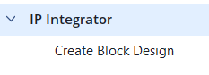\
    Ví dụ: đặt tên là _mainsystem_.
3. Ở cửa sổ **Block Design** ở giữa màn hình, mở **Design Sources**, rồi click vào _mainsystem_. Cửa sổ **Diagram** sẽ mở ra.
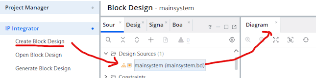
4. Click chuột phải vào vùng trống của Diagram (hoặc nhấn phím tắt Ctrl + I).\
   Gõ **Zynq** vào ô tìm kiếm.\
   Chọn **ZYNQ7 Processing System**.\
   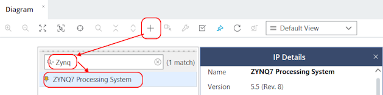
5. Trong cửa sổ **DIagram**, sẽ thấy một dòng thông báo màu xanh hiện lên ở trên cùng: _"Designer Assistance available. Run Block Automation"_.\
    Hãy nhấn vào dòng chữ **Run Block Automation**.\
    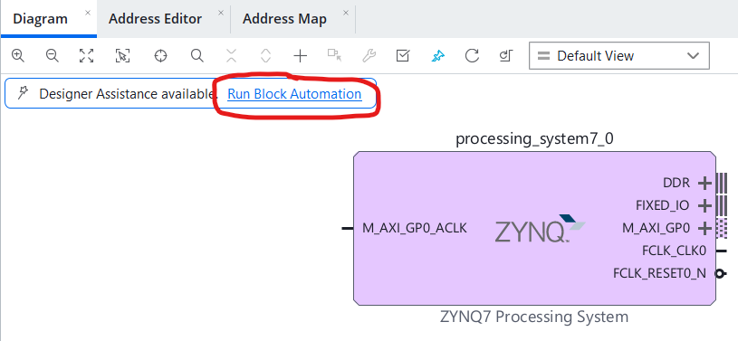\
    Nhấn **OK**.\
    Kết quả: Khối Zynq sẽ tự động xuất hiện các chân kết nối như **DDR (RAM)** và **FIXED_IO**. Đây là cấu hình "thần thánh" giúp Ubuntu trên PYNQ nhận diện được phần cứng mà không bị treo máy.
6. Thêm "Tay chân" (GPIO để điều khiển LED)
    - Nhấn Ctrl + I một lần nữa, tìm và thêm IP tên là **AXI GPIO**.
    - Double-click (nhấp đúp) vào khối **AXI GPIO** vừa hiện ra. ([Xem giải thích cách hoạt động ở đây](./Vivado.md#về-khối-softip-axi-gpio))
    - Trong tab **IP Configuration**, ở mục **GPIO**, chọn **All Outputs**.
    - Ở mục **GPIO Width**, nhập số **4** (tương ứng với 4 đèn LED trên PYNQ-Z2).
        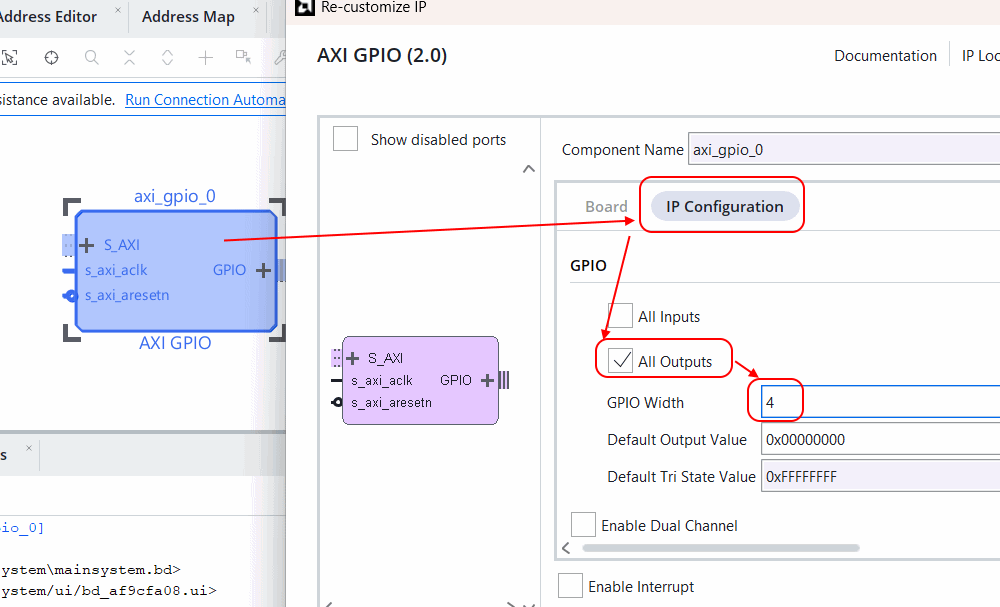
7. Kết nối vạn vật (Run Connection Automation)
    - Sau khi có GPIO, click vào dòng thông báo màu xanh: **Run Connection Automation**.
    - Tích chọn tất cả các ô (bao gồm cả **S_AXI** và **GPIO**).
    - Nhấn **OK**.\
    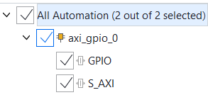
    - Trường hợp đã xóa trên giao diện Block Design, chỉ cần select 1 đối tượng Block thiếu nào đó, và bấm **Ctrl+T** để chương trình tự nối các cổng thiếu ra pin ngoài.
    > Vivado sẽ tự động vẽ thêm 2 khối: **Processor System Reset** và **AXI SmartConnect** (hoặc Interconnect), đồng thời nối dây xung nhịp (Clock) và dữ liệu (AXI) một cách hoàn chỉnh.
8. Tạo **bitstream**
    - Chuột phải vào file **.bd**, click **Create HDL Wrapper**.\
      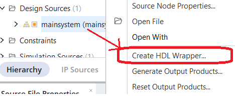
    - Bấm **Generate Bitstream**.
9. Kết quả, lúc này 2 file biên dịch thành phẩm là:
   - **.bit**: Nằm trong thư mục

        ```plain
            <Tên dự án>/<Tên dự án>.runs/impl_1/mainsystem_wrapper.bit
        ```

   - **.hwh**: Nằm trong thư mục

        ```plain
            <Tên dự án>/<Tên dự án>.gen\sources_1/bd/mainsystem/hw_handoff/mainsystem.hwh
        ```

10. Chạy chương trình [CollectBitStream.py](./CollectBitStream.py) ([Xem hướng dẫn sử dụng ở đây](./Vivado.md#công-cụ-collectbitstreampy)) để thu gom file .bit và .hwh và đẩy lên board TUL PYNQ-Z2 thông qua địa chỉ IP mặc định **192.168.2.99**.

### Chạy chương trình

- Chạy trực tiếp python trên shell

```shell
 source /etc/profile.d/pynq_venv.sh
 sudo -E python3 ./LedOn.py 12
```

- Chạy qua Jupiter Notebook

- Chạy quay file shell script đã có sẵn các môi trường trên

    ```shell
    ./runme.sh
    ```

## Examples
