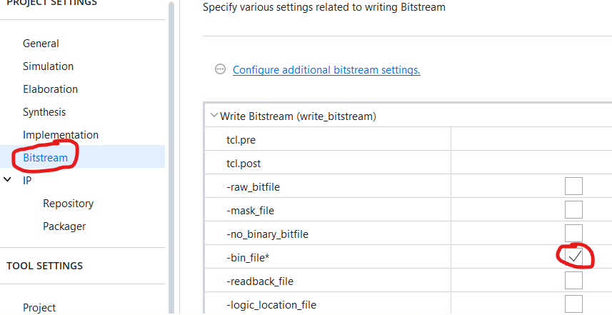

# AMD Vivado Design Suite

<!-- TOC -->

- [Các công cụ trong gói để làm việc với TUL PNYQ-Z2, hoặc Kria KV260](#c%C3%A1c-c%C3%B4ng-c%E1%BB%A5-trong-g%C3%B3i-%C4%91%E1%BB%83-l%C3%A0m-vi%E1%BB%87c-v%E1%BB%9Bi-tul-pnyq-z2-ho%E1%BA%B7c-kria-kv260)
- [Download](#download)
- [Thay đổi giao diện](#thay-%C4%91%E1%BB%95i-giao-di%E1%BB%87n)
- [Bổ sung thêm các Dev-Kit board mới](#b%E1%BB%95-sung-th%C3%AAm-c%C3%A1c-dev-kit-board-m%E1%BB%9Bi)
- [Mối quan hệ giữa file .bit và .hwh](#m%E1%BB%91i-quan-h%E1%BB%87-gi%E1%BB%AFa-file-bit-v%C3%A0-hwh)
- [Công cụ CollectBitStream.py](#c%C3%B4ng-c%E1%BB%A5-collectbitstreampy)
- [Cách thiết kế dạng Block Diagram](#c%C3%A1ch-thi%E1%BA%BFt-k%E1%BA%BF-d%E1%BA%A1ng-block-diagram)
    - [Khối Slide Bộ tách Bus](#kh%E1%BB%91i-slide-b%E1%BB%99-t%C3%A1ch-bus)
    - [Khối Concat Bộ gộp Bus](#kh%E1%BB%91i-concat-b%E1%BB%99-g%E1%BB%99p-bus)
    - [Khối AND, OR, XOR, NOT](#kh%E1%BB%91i-and-or-xor-not)
    - [Khối AXI GPIO Điều khiển cụm GPIO](#kh%E1%BB%91i-axi-gpio-%C4%90i%E1%BB%81u-khi%E1%BB%83n-c%E1%BB%A5m-gpio)
- [Về khối SoftIP AXI GPIO](#v%E1%BB%81-kh%E1%BB%91i-softip-axi-gpio)
    - [Các thanh ghi và địa chỉ](#c%C3%A1c-thanh-ghi-v%C3%A0-%C4%91%E1%BB%8Ba-ch%E1%BB%89)
    - [Cách xác định Base Address của khối AXI GPIO](#c%C3%A1ch-x%C3%A1c-%C4%91%E1%BB%8Bnh-base-address-c%E1%BB%A7a-kh%E1%BB%91i-axi-gpio)
- [Kiểm thử và mô phỏng](#ki%E1%BB%83m-th%E1%BB%AD-v%C3%A0-m%C3%B4-ph%E1%BB%8Fng)
    - [Giả lập bằng file testbench](#gi%E1%BA%A3-l%E1%BA%ADp-b%E1%BA%B1ng-file-testbench)
    - [Giả lập bằng can thiệp trực tiếp vào waveform](#gi%E1%BA%A3-l%E1%BA%ADp-b%E1%BA%B1ng-can-thi%E1%BB%87p-tr%E1%BB%B1c-ti%E1%BA%BFp-v%C3%A0o-waveform)
- [IO Planner - Gán chân Pin của SofIP với chân Pin vật lý](#io-planner---g%C3%A1n-ch%C3%A2n-pin-c%E1%BB%A7a-sofip-v%E1%BB%9Bi-ch%C3%A2n-pin-v%E1%BA%ADt-l%C3%BD)
- [Nạp thiết kế vĩnh viên vào QSPI Flash](#n%E1%BA%A1p-thi%E1%BA%BFt-k%E1%BA%BF-v%C4%A9nh-vi%C3%AAn-v%C3%A0o-qspi-flash)
- [Thanh chức năng FLOW NAVIGATOR](#thanh-ch%E1%BB%A9c-n%C4%83ng-flow-navigator)

<!-- /TOC -->

## Các công cụ trong gói để làm việc với TUL PNYQ-Z2, hoặc Kria KV260

1. **Vivado**: thiết kế sơ đồ mạch (Block Design) cho nhân SNN.
2. **Vitis HLS**: Công cụ cực kỳ mạnh mẽ để viết code C++ cho các nơ-ron spiking và để máy tự dịch sang mạch điện FPGA.
3. **Vitis IP Cache**: build dự án nhanh trong những lần chỉnh sửa sau.
4. **Cable Drivers**: Đảm bảo máy tính nhận diện được board PYNQ-Z2 ngay khi cắm cáp USB

## Download

1. Đăng kí tài khoản với **AMD**, hãng đã thôn tính **Xilinx**.\
   <https://www.amd.com/en/registration/create-account.html>/\
   _Lưu ý rằng: nếu khai bao địa chỉ là Việt Nam thì có thế không được quyền tải về. Hãy lấy thông tin địa chỉ đâu đó ở Singapo. Không cần fake IP_
2. Tải về file bộ cài chung. File **Unified** này không phải bộ câì offline, mà sẽ là bảng chọn để sau đó tải về các gói đầy đủ từ trên internet.
   <https://www.amd.com/en/products/software/adaptive-socs-and-fpgas/vivado/vivado-buy.html>
3. Chạy file _Unified_* nói trên, đến bước **Select Edition to Install**, sẽ thấy các lựa chọn:\
   
   - **Vitis**: sẽ bao gồm cả **Vivado** và **Vitis HLS**. **Vitis HLS** sẽ giúp thiết kế mức cao với C++ nên dễ triển khai mạng **SNN**.
   - **Vivado**: Chỉ thiết kế phần cứng thuần túy ở mức **RTL** và **Structural**, với các ngôn ngữ **Verilog**, **SystemVerilog**, hoặc **VHDL**. Rất khó khăn khi muốn chạy Linux/PYNQ mượt mà.
   - **Vitis Embedded Development**: Bản này rút gọn hơn.
   - **Lab Edition / Hardware Server**: Chỉ dùng cho máy tính nào chỉ làm nhiệm vụ nạp code (không dùng để thiết kế).
   - **Power Design Manager (PDM)**: Dùng để tính toán công suất tiêu thụ (chưa cần thiết lúc này).
   Tóm lại, chọn **Vitis**.
4. Ở cửa sổ **Vitis Unified Software Platform** thực hiện tích chọn các tính năng sau giống như trong ảnh, phù hợp với kit **TUL PYNQ-Z2**.\
   
   - **Vitis IP Cache**: là một tính năng "cứu cánh" giúp tiết kiệm hàng giờ đồng hồ ngồi chờ đợi mỗi khi biên dịch (Compile) dự án trên **Vivado**. Đặc biệt khi triển khai mạng SNN, sẽ sử dụng rất nhiều khối IP (như nhân xử lý Zynq, bộ nhớ RAM, bộ nhân, hoặc các khối HLS tự viết), và thậm chí là nhiều khối IP giống nhau, nó sẽ giúp giảm thời gian xử lý từ lần thứ 2 trở đi, hàng chục lần.\
   _Lưu ý: Vị trí chứa cache xem ở giao diện **Settings / IP / Repository**._\
   _Lưu ý: Đôi khi Cache bị "lỗi thời" (mạch chạy không đúng như code), hãy vào menu **Reports / IP Status** để Clear Cache và bắt nó chạy lại từ đầu cho chắc chắn_
   - **Vitis Network P4** cho phép lập trình FPGA bằng ngôn ngữ **P4** (Programming Protocol-independent Packet Processors).
      - Rất tuyệt để bắt các gói tin từ mạng LAN, sau đó trích xuất dữ liệu (ví dụ: các giá trị cảm biến hoặc dữ liệu ảnh) để đưa vào các nơ-ron SNN xử lý ngay lập tức (In-network processing).
            ```C
               if (packet.header == IPv4) { forward to SNN_core; }
            ```
      - Chỉ hỗ trợ các dòng chip cao cấp như **Alveo**, **Versal** hoặc **UltraScale+**, ví dụ dev kit **Kria KV260** là okay. KHÔNG hỗ chip **Zynq-7000**.
      - KHÔNG MIỄN PHÍ.\
   - _Lưu ý: với dev kit **Kria KV260** thì tick vào mục **Zynq UltraScale+ MPSoCs** là xong._
5. Chọn các thư mục cài đặt. Cứ để mặc định.\
   

## Thay đổi giao diện

Vivado 2025.2 đã bắt đầu có giao diện mới. Mặc dù vậy, giao diện mặc định vẫn là cũ. Không những vậy, 2 giao diện này còn khác nhau cả location lưu trữ các board, IPCore... nên cần làm ngay từ khi cài đặt ứng dụng

Để chuyển đổi giữa các giao diện thì:

- Trên thanh menubar, chọn **Tools** / **Settings..**.\
  
- Click **Try the new Vivado IDE** để chuyển giữa 2 loại giao diện.\
   

## Bổ sung thêm các Dev-Kit board mới

- Trên thanh menubar, chọn **Tools** / **Settings..**.\
  
- Trong thanh **TOOL SETTINGS** bên trái, chọn **Vivado Store**, chọn **Board Repository**\.
   
- Bấm **+** để đưa cấu hình các board mới.\
   \
   Ví dụ **board file của PNYQ-Z2** để bổ sung vào Vivado có thể tải ở đây [online](https://github.com/xupsh/pynq-supported-board-file), [offline](./TUL_PYNQ-Z2-BoardFile/A.0/)

## Mối quan hệ giữa file .bit và .hwh

File **bitstream .bit** là file cấu hình FPGA.\
Còn **Hardware Handoff .hwh** là tử điền địa chỉ, là driver để phần ARM core có thể hiểu địa chỉ kiểm soát module **SoftIP** đó.\


> Xem thêm công cụ thu thập và nap luôn lên thẻ nhớ [CollectBitStream.py](#công-cụ-collectbitstreampy)

## Công cụ CollectBitStream.py

- File [CollectBitStream.py](./CollectBitStream.py): tìm, đồng bộ tên file .bit và .hwh theo tên dự án, và **copy** lên thẻ nhớ/board PYNQ-Z2 từ xa.
- Sử dụng:

   ```shell
   python ./CollectBitStream.py
   
   🚀 Dự án: LedOn
   ---------------------------------------------
   📝 BIT found: 2026-03-25 23:26:22 (29 phút trước)
   📝 HWH found: 2026-03-25 15:58:47 (477 phút trước)
   ---------------------------------------------
   📡 Đang kết nối tới PYNQ (192.168.2.99)...
   📤 Uploading BIT... OK
   📤 Uploading HWH... OK
   ---------------------------------------------
   ✅ THÀNH CÔNG! File đã nằm tại: /home/xilinx/LedOn
   💡 Trong Jupyter, bạn gọi: Overlay('LedOn.bit')
   ---------------------------------------------
   Bấm phím bất kì để kết thúc...
   ```

## Cách thiết kế dạng Block Diagram

### Khối Slide (Bộ tách Bus)

[Xem thêm khối Concat, làm ngược lại](#khối-concat-bộ-gộp-bus)

### Khối Concat (Bộ gộp Bus)

[Xem thêm khối Slide, làm ngược lại](#khối-slide-bộ-tách-bus)

### Khối AND, OR, XOR, NOT

Không có khối nào có tên như vậ, mà chúng nằm trong SoftIP có tên **Utility Vector Logic** và **Utility Reduced Logic**.

- **Utility Reduced Logic**: là các mạch logic với single signal vào, single signal ra.
- **Utility Vector Logic**: là các mạch logic với bus vào, bus ra.\


### Khối AXI GPIO (Điều khiển cụm GPIO)

[Xem chi tiết ở đây](#về-khối-softip-axi-gpio)

## Về khối SoftIP AXI GPIO


- Đây là khối SoftIP, có thể tùy ý bổ sung
- Mỗi khối AXI GPIO có 2 kênh GPIO, vai trò tương đương.
- Mỗi kênh GPIO thường chỉ nên thiết lập theo 1 hướng cố định: hoặc output, hoặc input, hoặc tristate.

### Các thanh ghi và địa chỉ


Nếu địa chỉ gốc/**Base Address** của khối GPIO 0x4120_0000 ([cách tìm thông tin này ở đây](#cách-xác-định-base-address-của-khối-axi-gpio)), thì các thanh ghi sẽ ở vị trí sau

Địa chỉ Offset|Tên thanh ghi|Chức năng
--|--|--
0x0000|GPIO_DATA|Đọc/Ghi dữ liệu cho Kênh 1.
0x0004|GPIO_TRI|Điều khiển hướng (_t) cho Kênh 1.
0x0008|GPIO2_DATA|Đọc/Ghi dữ liệu cho Kênh 2 (nếu có).
0x000C|GPIO2_TRI|Điều khiển hướng (_t) cho Kênh 2 (nếu có).

### Cách xác định Base Address của khối AXI GPIO

1. Trong giao diện **Block Design**, nhìn lên các tab ở phía trên cùng của cửa sổ vẽ sơ đồ.
2. Tìm tab tên là **Address Editor**.
3. Danh sách tất cả các khối IP (AXI GPIO 0, AXI GPIO 1, v.v.) được liệt kê trong giao diện
4. Cột **Offset Address** chính là địa chỉ định danh mà ARM sẽ dùng để gọi khối đó.
   
5. Hoặc xem trong tab tên là **Address Map**, theo góc nhìn từ ARM core, lập trình.\
   

## Kiểm thử và mô phỏng

Chạy Simulation (Mô phỏng) là một bước cực kỳ quan trọng giúp kiểm tra thiết kế. Trong tài liệu này, chỉ tập trung vào kiểm tra thiết kế SoftIP, chứ không liên quan tới phần nối giữa SoftIP và MCU ARM nếu có.

Có 2 cách thực hiện:

1. Sử dụng file [**testbench**](#giả-lập-bằng-file-testbench).
   - Ưu điểm: Cần lập trình verilog. Tương tự như viết Unitest.
   - Nhược điểm: Lâu lúc bắt đầu
2. Can thiệp trực tiếp trên [**waveform**](#giả-lập-bằng-can-thiệp-trực-tiếp-vào-waveform).
    - Ưu điểm: Cực nhanh, trực quan, không cần học cú pháp Verilog Testbench.
    - Nhược điểm: Bấm nút run nhiều lần, không tự động hóa được.

### Giả lập bằng file testbench

1. Tạo **Testbench**: Vào mục **Sources** -> Chuột phải chọn **Add Sources** -> **Add or create simulation sources**.\

2. Tạo một file mới với tên theo convension **tb_.....v**.
3. Viết code giả lập với các Stimulators đẩy vào nguồn.

   ```Verilog
   `timescale 1ns / 1ps      // Bước nhảy 1 ns, độ phân ly tính toán/chính xác là 1ps

   module tb_decoder();
       reg [1:0] sw_test;    // Stimulator - Tín hiệu giả lập đầu vào 
       wire [3:0] led_test;  // Stimulator- Tín hiệu quan sát đầu ra

       // Gọi module thực tế vào để kiểm tra, nối module với các Stimulators
       decoder_2to4 uut (
           .sw(sw_test),
           .led(led_test)
       );

       initial begin
           // Tạo bộ dữ liệu cho Stimulators
           sw_test = 2'b00; 
           led_test = 6'b000000;
           #10; 
           sw_test = 2'b01; 
           led_test = 6'b100001;
           #10;
           sw_test = 2'b10; 
           led_test = 6'b010010;
           #10;
           sw_test = 2'b11; 
           led_test = 6'b001100;
           #10;
           $stop; // Dừng mô phỏng
       end
   endmodule
   ```

4. Chạy **Simulation**: Click vào **Run Simulation** -> **Run Behavioral Simulation**.

### Giả lập bằng can thiệp trực tiếp vào waveform

- **Bước 1: Thiết lập Simulation cho Module.**
  - Trong cửa sổ Sources, tìm đến file Verilog cần giả lập. Chuột phải và chọn Set as Top (để Vivado biết đây là đối tượng chính cần mô phỏng). _Không bắt buộc, nhưng sẽ tránh rối loạn trong quá nhiều module đã thiết kế_
  - Nhấn **Run Simulation** -> **Run Behavioral Simulation**.
- **Bước 2: Force giá trị**(Ép tín hiệu)
   Khi cửa sổ Waveform hiện ra, các tín hiệu ban đầu sẽ ở trạng thái "Z" hoặc "X" (chưa xác định).
  - Tại bảng **Scopes** hoặc **Objects**, tìm tín hiệu đầu vào càn giả lập, ví dụ sw[1:0].
  - Chuột phải vào sw[1:0] và chọn **Force Constant**.
  - Trong ô **Value**, nhập giá trị nhị phân (ví dụ: 00). Nhấn **OK**.
- **Bước 3: Chạy mô phỏng (Step)**
  - Trên thanh công cụ mô phỏng, tìm ô thời gian (mặc định là 10us) và nhấn nút Run for... (biểu tượng mũi tên và đồng hồ cát).
  - Quan sát tín hiệu đầu ra, ví dụ led[3:0], và xem nó đổi giá có đúng không.
  - Nhấn nút **Run for**... một lần nữa.


## IO Planner - Gán chân Pin của SofIP với chân Pin vật lý

1. Thiết kế bằng **HDL** hoặc **Block Design** (sau đó phải sinh mã **HDL**)
2. Ở thành left side bar **FLOW NAVIGATOR** / mục **Synthesis**, bấm **Run Synthesis** để Vivado biết các chân Pin của SoftIP.\**
3. Trong quá trình tổng hợp, các mục **Open synthesized Design** sẽ bị bôi xám. Đợi vài phút.
4. Sau khi tổng hợp xong, bấm **Open synthesized Design**
5. Trên thanh công cụ phía trên cùng, hãy đổi Layout từ **Default** sang **I/O Planning**.

6. Trên màn hình **I/O Ports**, ở bảng bên dưới sẽ thấy danh sách các chân pin của SoftIP đã được **Make External** trước đó trong **Block Design**, như trong ảnh minh họa là rgb_leds, sw_inputs.
   - Ở cột **Package Pin**, gõ tên chân (ví dụ: L15) hoặc chọn từ menu thả xuống.
   - Ở cột **I/O Standard**, chọn mức điện áp phù hợp. Ví dụ LVCMOS33.
   > Sau khi chọn, các chân trên hình ảnh con chip ở giữa màn hình sáng lên khi gán đúng.

7. Lưu file **.xdc**.

## Nạp thiết kế vĩnh viên vào QSPI Flash

Được dùng khi bản thiết kế được áp dụng ngay khi cấp nguồn mà không cần thông qua hệ điều hành (Linux/Python).

- Bước 1: Tạo file **.bin** trong **Vivado** (mặc định Vivado chỉ tạo file **.bit**)
  1. Vào Settings -> Bitstream.
  2. Tích chọn ô -bin_file.
  3. Nhấn OK và chạy lại Generate Bitstream.
  
  4. Sau khi xong, file **.bin** sẽ nằm cùng thư mục với file **.bit** (thường là trong .../<ProjectName>.runs/impl_1/).

- Bước 2: Thiết lập Jumper trên Dev kit, để board hiểu rằng nó phải đọc dữ liệu từ Flash khi khởi động thay vì thẻ nhớ SD:
  - Tìm Jumper có chữ **BOOT** (gần đầu cắm nguồn/thẻ nhớ).
  - Chuyển Jumper từ vị trí **SD** sang vị trí **QSPI**.

- Bước 3: Nạp file **.bin** vào Flash bằng **Vivado**
  - Mở **Hardware Manager** trong Vivado và kết nối với board (**Open Target**).
  - Chuột phải vào chip FPGA (ví dụ: xc7z020_1) và chọn **Add Configuration Memory Device**.
  - Trong bảng danh sách hiện ra, cần chọn đúng loại chip Flash trên PYNQ-Z2.
    - Hãy tìm: spansion (hoặc Cypress).
    - Model cụ thể thường là: s25fl128s-3.3v-qspi-x4-single.
  - Vivado sẽ hỏi: _có muốn nạp file ngay bây giờ không?_. Chọn **Yes**.
  - Trong cửa sổ **Program Configuration Memory Device**:
    - **Configuration file**: Trỏ đến file **.bin**.
    - **PRM file**: (để trống).
    - Tích chọn: **Erase, Blank Check, Program, Verify.**
    - Nhấn OK. Quá trình này sẽ mất khoảng 1-2 phút vì nó phải xóa Flash và ghi dữ liệu mới.

- Bước 4: Kiểm tra thành quả
  - Vivado báo "Program Operation Successful"
  - Nhấn nút PROG (hoặc tắt nguồn bật lại) trên board.
  - Xong

> Lưu ý cực kỳ quan trọng đối với PYNQ hoặc các kit có MCU core:
>
> - Khi đổi BOOT jumper thì hệ thống thì board sẽ không boot vào Linux (PYNQ) nữa, không AXI4. Nó chỉ chạy duy nhất logic FPGA nên cũng không có Linux hay ARM core nữa.
> - Chỉnh BOOT jumber về SDCard là lại bình thường.

## Thanh chức năng FLOW NAVIGATOR

Index | Chức năng (Sidebar) | Ý nghĩa chức năng | Link tham khảo |
:--- | :--- | :--- | :--- |
**1** | **Project Manager** | **Quản lý tổng thể dự án và tài nguyên.** | [UG892](https://docs.amd.com/r/en-US/892-vivado-design-analysis-closure-tutorial/Project-Manager) |
1.1 | Settings | Cấu hình thông số dự án, chọn dòng chip, thư mục và thiết lập tool. | |
1.2 | Add Sources | Thêm/Tạo file thiết kế (HDL), ràng buộc (XDC) hoặc file mô phỏng. | |
1.3 | Language Templates | Kho chứa các mẫu code chuẩn (Verilog, VHDL, XDC) để copy nhanh. | |
1.4 | IP Catalog | Thư viện các khối IP lõi có sẵn (Memory, DSP, Clocking...). | |
**2** | **IP Integrator** | **Thiết kế hệ thống dựa trên sơ đồ khối (Block Design).** | [UG994](https://docs.amd.com/r/en-US/994-vivado-ip-subsystem-design-tutorial/IP-Integrator) |
2.1 | Create Block Design | Tạo môi trường đồ họa mới để kết nối các IP phức tạp. | |
2.2 | Open Block Design | Mở sơ đồ khối hiện có để chỉnh sửa. | |
2.3 | Generate Block Design | Biên dịch sơ đồ khối sang mã nguồn HDL cho các bước sau. | |
**3** | **Simulation** | **Kiểm tra tính đúng đắn của logic bằng mô phỏng.** | [UG900](https://docs.amd.com/r/en-US/900-vivado-logic-simulation) |
3.1 | Run Simulation | Chạy phần mềm mô phỏng để quan sát dạng sóng (Waveform). | |
**4** | **RTL Analysis** | **Phân tích logic ở mức Register-Transfer Level.** | [UG901](https://docs.amd.com/r/en-US/901-vivado-synthesis) |
4.1 | Run Linter | Kiểm tra lỗi cú pháp và các quy tắc viết code (Coding Styles). | |
4.2 | Open Elaborated Design | Dựng sơ đồ mạch sơ bộ từ mã nguồn RTL. | |
4.2.1 | - Report Methodology | Báo cáo các vi phạm về phương pháp luận thiết kế. | |
4.2.2 | - Report DRC | Kiểm tra quy tắc thiết kế (Design Rule Check) mức vật lý. | |
4.2.3 | - Report Noise | Phân tích nhiễu tín hiệu dự kiến. | |
4.2.4 | - Schematic | Xem sơ đồ nguyên lý tổ hợp từ code. | |
**5** | **Synthesis** | **Tổng hợp thiết kế thành Netlist cổng logic.** | [UG901](https://docs.amd.com/r/en-US/901-vivado-synthesis) |
5.1 | Run Synthesis | Thực hiện tối ưu hóa và chuyển đổi code thành cổng logic. | |
5.2 | Open Synthesized Design | Mở thiết kế sau khi tổng hợp để phân tích sâu. | |
5.2.1 | - Constraints Wizard | Công cụ hướng dẫn tạo các ràng buộc thời gian/chân chip. | |
5.2.2 | - Edit Timing Constraints | Chỉnh sửa thủ công các file ràng buộc thời gian (XDC). | |
5.2.3 | - Set Up Debug | Cấu hình các lõi ILA để theo dõi tín hiệu thực tế trên chip. | |
5.2.4 | - Open Dataflow Design | Xem sơ đồ luồng dữ liệu xử lý trong mạch. | |
5.2.5 | - Report Timing Summary | Báo cáo tổng kết về các ràng buộc thời gian (Slack). | |
5.2.6 | - Report Clock Networks | Phân tích cấu trúc cây xung nhịp (Clock tree). | |
5.2.7 | - Report Clock Interaction | Kiểm tra sự tương tác giữa các vùng clock khác nhau. | |
5.2.8 | - Report Methodology | Kiểm tra lại phương pháp luận sau tổng hợp. | |
5.2.9 | - Report DRC | Kiểm tra lỗi thiết kế sau khi đã ánh xạ vào thư viện cổng. | |
5.2.10 | - Report Noise | Đánh giá lại nhiễu sau tổng hợp. | |
5.2.11 | - Report Utilization | Báo cáo mức độ sử dụng tài nguyên (LUT, FF, BRAM, DSP). |Tài nguyên|
5.2.12 | - Report Power | Ước tính mức tiêu thụ điện năng dựa trên netlist. | |
5.2.13 | - Schematic | Xem sơ đồ mạch chi tiết sau tối ưu hóa. | |
**6** | **Implementation** | **Xếp linh kiện và đi dây thực tế trên chip.** | [UG904](https://docs.amd.com/r/en-US/904-vivado-implementation) |
6.1 | Run Implementation | Chạy thuật toán đặt vị trí và đi dây (Place & Route). | |
6.2 | Open Implemented Design | Xem thiết kế vật lý cuối cùng trên bản đồ chip. | |
6.2.1 | - Constraints Wizard | Rà soát ràng buộc dựa trên vị trí vật lý thực tế. | |
6.2.2 | - Open Dataflow Design | Phân tích luồng dữ liệu trên sơ đồ thực tế. | |
6.2.3 | - Edit Timing Constraints | Chỉnh sửa ràng buộc dựa trên kết quả đi dây thực tế. | |
6.2.4 | - Report Timing Summary | Báo cáo thời gian cuối cùng (quyết định mạch có chạy được không). |Max Clockrate|
6.2.5 | - Report Clock Networks | Xem mạng lưới clock sau khi đã đi dây vật lý. | |
6.2.6 | - Report Clock Interaction | Phân tích kỹ các lỗi crossing clock domain vật lý. | |
6.2.7 | - Report Methodology | Báo cáo phương pháp luận lần cuối. | |
6.2.8 | - Report DRC | Kiểm tra lỗi vật lý cuối cùng trước khi sinh bitstream. | |
6.2.9 | - Report Noise | Phân tích nhiễu điện từ trên các đường dây thực tế. | |
6.2.10 | - Report Utilization | Thống kê chính xác số lượng linh kiện thực tế bị chiếm dụng. |Tài nguyên|
6.2.11 | - Report Power | Báo cáo công suất tiêu thụ chính xác nhất. | |
6.2.12 | - Schematic | Xem sơ đồ kết nối vật lý cuối cùng. | |
**7** | **Program and Debug** | **Nạp file và gỡ lỗi trên phần cứng.** | [UG908](https://docs.amd.com/r/en-US/908-vivado-programming-debugging) |
7.1 | Generate Bitstream | Tạo file nhị phân (.bit) để nạp vào FPGA. | |
7.2 | Open Hardware Manager | Kết nối với phần cứng qua cáp JTAG. | |
7.2.1 | - Open Target | Dò tìm và kết nối với kit FPGA đang cắm vào máy. | |
7.2.2 | - Program Device | Nạp file .bit vào bộ nhớ SRAM của FPGA. | |
7.2.3 | - Add Config Memory | Nạp file cấu hình vào bộ nhớ Flash để giữ mạch khi mất điện. | |
