# AMD Vivado Design Suite

<!-- TOC -->

- [Các công cụ trong gói để làm việc với TUL PNYQ-Z2, hoặc Kria KV260](#c%C3%A1c-c%C3%B4ng-c%E1%BB%A5-trong-g%C3%B3i-%C4%91%E1%BB%83-l%C3%A0m-vi%E1%BB%87c-v%E1%BB%9Bi-tul-pnyq-z2-ho%E1%BA%B7c-kria-kv260)
- [Download](#download)
- [Thay đổi giao diện](#thay-%C4%91%E1%BB%95i-giao-di%E1%BB%87n)
- [Bổ sung thêm các Dev-Kit board mới](#b%E1%BB%95-sung-th%C3%AAm-c%C3%A1c-dev-kit-board-m%E1%BB%9Bi)
- [Mối quan hệ giữa file .bit và .hwh](#m%E1%BB%91i-quan-h%E1%BB%87-gi%E1%BB%AFa-file-bit-v%C3%A0-hwh)
- [Công cụ CollectBitStream.py](#c%C3%B4ng-c%E1%BB%A5-collectbitstreampy)
- [Cách thiết kế dạng Block Diagram](#c%C3%A1ch-thi%E1%BA%BFt-k%E1%BA%BF-d%E1%BA%A1ng-block-diagram)
    - [Khối Slide Bộ tách Bus](#kh%E1%BB%91i-slide-b%E1%BB%99-t%C3%A1ch-bus)
    - [Khối Concat Bộ gộp Bus](#kh%E1%BB%91i-concat-b%E1%BB%99-g%E1%BB%99p-bus)
    - [Khối AND, OR, XOR, NOT](#kh%E1%BB%91i-and-or-xor-not)
    - [Khối AXI GPIO Điều khiển cụm GPIO](#kh%E1%BB%91i-axi-gpio-%C4%90i%E1%BB%81u-khi%E1%BB%83n-c%E1%BB%A5m-gpio)
- [Về khối SoftIP AXI GPIO](#v%E1%BB%81-kh%E1%BB%91i-softip-axi-gpio)
    - [Các thanh ghi và địa chỉ](#c%C3%A1c-thanh-ghi-v%C3%A0-%C4%91%E1%BB%8Ba-ch%E1%BB%89)
    - [Cách xác định Base Address của khối AXI GPIO](#c%C3%A1ch-x%C3%A1c-%C4%91%E1%BB%8Bnh-base-address-c%E1%BB%A7a-kh%E1%BB%91i-axi-gpio)
- [Kiểm thử và mô phỏng](#ki%E1%BB%83m-th%E1%BB%AD-v%C3%A0-m%C3%B4-ph%E1%BB%8Fng)
    - [Giả lập bằng file testbench](#gi%E1%BA%A3-l%E1%BA%ADp-b%E1%BA%B1ng-file-testbench)
    - [Giả lập bằng can thiệp trực tiếp vào waveform](#gi%E1%BA%A3-l%E1%BA%ADp-b%E1%BA%B1ng-can-thi%E1%BB%87p-tr%E1%BB%B1c-ti%E1%BA%BFp-v%C3%A0o-waveform)
- [IO Planner - Gán chân Pin của SofIP với chân Pin vật lý](#io-planner---g%C3%A1n-ch%C3%A2n-pin-c%E1%BB%A7a-sofip-v%E1%BB%9Bi-ch%C3%A2n-pin-v%E1%BA%ADt-l%C3%BD)

<!-- /TOC -->

## Các công cụ trong gói để làm việc với TUL PNYQ-Z2, hoặc Kria KV260

1. **Vivado**: thiết kế sơ đồ mạch (Block Design) cho nhân SNN.
2. **Vitis HLS**: Công cụ cực kỳ mạnh mẽ để viết code C++ cho các nơ-ron spiking và để máy tự dịch sang mạch điện FPGA.
3. **Vitis IP Cache**: build dự án nhanh trong những lần chỉnh sửa sau.
4. **Cable Drivers**: Đảm bảo máy tính nhận diện được board PYNQ-Z2 ngay khi cắm cáp USB

## Download

1. Đăng kí tài khoản với **AMD**, hãng đã thôn tính **Xilinx**.\
   <https://www.amd.com/en/registration/create-account.html>/\
   _Lưu ý rằng: nếu khai bao địa chỉ là Việt Nam thì có thế không được quyền tải về. Hãy lấy thông tin địa chỉ đâu đó ở Singapo. Không cần fake IP_
2. Tải về file bộ cài chung. File **Unified** này không phải bộ câì offline, mà sẽ là bảng chọn để sau đó tải về các gói đầy đủ từ trên internet. 
   <https://www.amd.com/en/products/software/adaptive-socs-and-fpgas/vivado/vivado-buy.html>
3. Chạy file *Unified** nói trên, đến bước **Select Edition to Install**, sẽ thấy các lựa chọn:\
   
   - **Vitis**: sẽ bao gồm cả **Vivado** và **Vitis HLS**. **Vitis HLS** sẽ giúp thiết kế mức cao với C++ nên dễ triển khai mạng **SNN**.
   - **Vivado**: Chỉ thiết kế phần cứng thuần túy ở mức **RTL** và **Structural**, với các ngôn ngữ **Verilog**, **SystemVerilog**, hoặc **VHDL**. Rất khó khăn khi muốn chạy Linux/PYNQ mượt mà.
   - **Vitis Embedded Development**: Bản này rút gọn hơn.
   - **Lab Edition / Hardware Server**: Chỉ dùng cho máy tính nào chỉ làm nhiệm vụ nạp code (không dùng để thiết kế).
   - **Power Design Manager (PDM)**: Dùng để tính toán công suất tiêu thụ (chưa cần thiết lúc này).
   Tóm lại, chọn **Vitis**.
4. Ở cửa sổ **Vitis Unified Software Platform** thực hiện tích chọn các tính năng sau giống như trong ảnh, phù hợp với kit **TUL PYNQ-Z2**.\
   
   - **Vitis IP Cache**: là một tính năng "cứu cánh" giúp tiết kiệm hàng giờ đồng hồ ngồi chờ đợi mỗi khi biên dịch (Compile) dự án trên **Vivado**. Đặc biệt khi triển khai mạng SNN, sẽ sử dụng rất nhiều khối IP (như nhân xử lý Zynq, bộ nhớ RAM, bộ nhân, hoặc các khối HLS tự viết), và thậm chí là nhiều khối IP giống nhau, nó sẽ giúp giảm thời gian xử lý từ lần thứ 2 trở đi, hàng chục lần.\
   _Lưu ý: Vị trí chứa cache xem ở giao diện **Settings / IP / Repository**._\
   _Lưu ý: Đôi khi Cache bị "lỗi thời" (mạch chạy không đúng như code), hãy vào menu **Reports / IP Status** để Clear Cache và bắt nó chạy lại từ đầu cho chắc chắn_
   - **Vitis Network P4** cho phép lập trình FPGA bằng ngôn ngữ **P4** (Programming Protocol-independent Packet Processors).
      - Rất tuyệt để bắt các gói tin từ mạng LAN, sau đó trích xuất dữ liệu (ví dụ: các giá trị cảm biến hoặc dữ liệu ảnh) để đưa vào các nơ-ron SNN xử lý ngay lập tức (In-network processing).
            ```C
               if (packet.header == IPv4) { forward to SNN_core; }
            ```
      - Chỉ hỗ trợ các dòng chip cao cấp như **Alveo**, **Versal** hoặc **UltraScale+**, ví dụ dev kit **Kria KV260** là okay. KHÔNG hỗ chip **Zynq-7000**.
      - KHÔNG MIỄN PHÍ.\
   - _Lưu ý: với dev kit **Kria KV260** thì tick vào mục **Zynq UltraScale+ MPSoCs** là xong._
5. Chọn các thư mục cài đặt. Cứ để mặc định.\
   

## Thay đổi giao diện

Vivado 2025.2 đã bắt đầu có giao diện mới. Mặc dù vậy, giao diện mặc định vẫn là cũ. Không những vậy, 2 giao diện này còn khác nhau cả location lưu trữ các board, IPCore... nên cần làm ngay từ khi cài đặt ứng dụng

Để chuyển đổi giữa các giao diện thì:

- Trên thanh menubar, chọn **Tools** / **Settings..**.\
  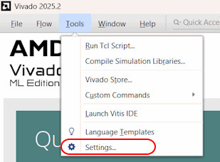
- Click **Try the new Vivado IDE** để chuyển giữa 2 loại giao diện.\
   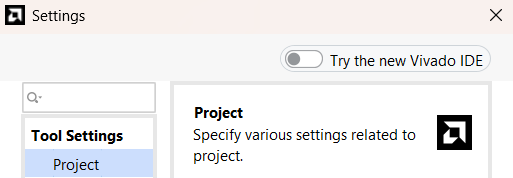

## Bổ sung thêm các Dev-Kit board mới

- Trên thanh menubar, chọn **Tools** / **Settings..**.\
  
- Trong thanh **TOOL SETTINGS** bên trái, chọn **Vivado Store**, chọn **Board Repository**\.
   
- Bấm **+** để đưa cấu hình các board mới.\
   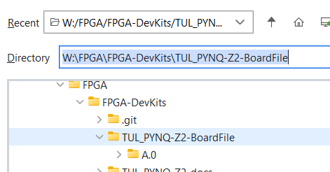\
   Ví dụ **board file của PNYQ-Z2** để bổ sung vào Vivado có thể tải ở đây [online](https://github.com/xupsh/pynq-supported-board-file), [offline](./TUL_PYNQ-Z2-BoardFile/A.0/)

## Mối quan hệ giữa file .bit và .hwh

File **bitstream .bit** là file cấu hình FPGA.\
Còn **Hardware Handoff .hwh** là tử điền địa chỉ, là driver để phần ARM core có thể hiểu địa chỉ kiểm soát module **SoftIP** đó.\
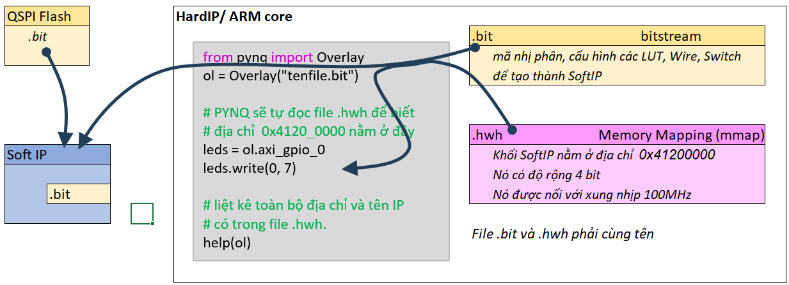

> Xem thêm công cụ thu thập và nap luôn lên thẻ nhớ [CollectBitStream.py](#công-cụ-collectbitstreampy)

## Công cụ CollectBitStream.py

- File [CollectBitStream.py](./CollectBitStream.py): tìm, đồng bộ tên file .bit và .hwh theo tên dự án, và **copy** lên thẻ nhớ/board PYNQ-Z2 từ xa.
- Sử dụng:

   ```shell
   python ./CollectBitStream.py
   
   🚀 Dự án: LedOn
   ---------------------------------------------
   📝 BIT found: 2026-03-25 23:26:22 (29 phút trước)
   📝 HWH found: 2026-03-25 15:58:47 (477 phút trước)
   ---------------------------------------------
   📡 Đang kết nối tới PYNQ (192.168.2.99)...
   📤 Uploading BIT... OK
   📤 Uploading HWH... OK
   ---------------------------------------------
   ✅ THÀNH CÔNG! File đã nằm tại: /home/xilinx/LedOn
   💡 Trong Jupyter, bạn gọi: Overlay('LedOn.bit')
   ---------------------------------------------
   Bấm phím bất kì để kết thúc...
   ```

## Cách thiết kế dạng Block Diagram

### Khối Slide (Bộ tách Bus)

[Xem thêm khối Concat, làm ngược lại](#khối-concat-bộ-gộp-bus)

### Khối Concat (Bộ gộp Bus)

[Xem thêm khối Slide, làm ngược lại](#khối-slide-bộ-tách-bus)

### Khối AND, OR, XOR, NOT

Không có khối nào có tên như vậ, mà chúng nằm trong SoftIP có tên **Utility Vector Logic** và **Utility Reduced Logic**.

- **Utility Reduced Logic**: là các mạch logic với single signal vào, single signal ra.
- **Utility Vector Logic**: là các mạch logic với bus vào, bus ra.\
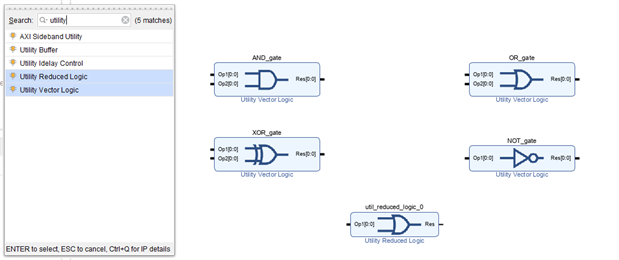

### Khối AXI GPIO (Điều khiển cụm GPIO)

[Xem chi tiết ở đây](#về-khối-softip-axi-gpio)

## Về khối SoftIP AXI GPIO

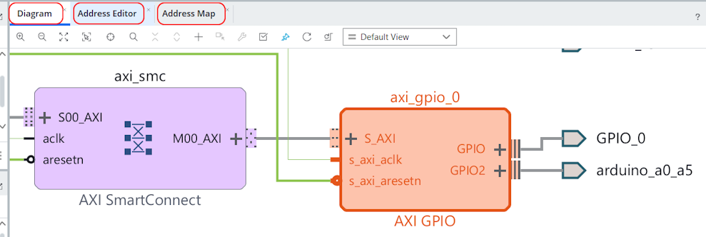

- Đây là khối SoftIP, có thể tùy ý bổ sung
- Mỗi khối AXI GPIO có 2 kênh GPIO, vai trò tương đương.
- Mỗi kênh GPIO thường chỉ nên thiết lập theo 1 hướng cố định: hoặc output, hoặc input, hoặc tristate.

### Các thanh ghi và địa chỉ

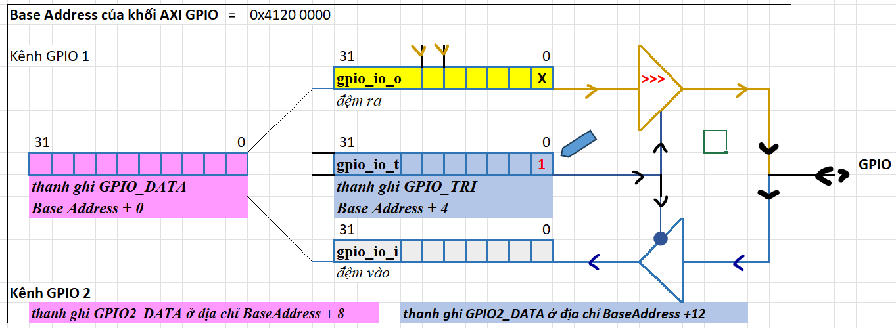

Nếu địa chỉ gốc/**Base Address** của khối GPIO 0x4120_0000 ([cách tìm thông tin này ở đây](#cách-xác-định-base-address-của-khối-axi-gpio)), thì các thanh ghi sẽ ở vị trí sau

Địa chỉ Offset|Tên thanh ghi|Chức năng
--|--|--
0x0000|GPIO_DATA|Đọc/Ghi dữ liệu cho Kênh 1.
0x0004|GPIO_TRI|Điều khiển hướng (_t) cho Kênh 1.
0x0008|GPIO2_DATA|Đọc/Ghi dữ liệu cho Kênh 2 (nếu có).
0x000C|GPIO2_TRI|Điều khiển hướng (_t) cho Kênh 2 (nếu có).

### Cách xác định Base Address của khối AXI GPIO

1. Trong giao diện **Block Design**, nhìn lên các tab ở phía trên cùng của cửa sổ vẽ sơ đồ.
2. Tìm tab tên là **Address Editor**.
3. Danh sách tất cả các khối IP (AXI GPIO 0, AXI GPIO 1, v.v.) được liệt kê trong giao diện
4. Cột **Offset Address** chính là địa chỉ định danh mà ARM sẽ dùng để gọi khối đó.
   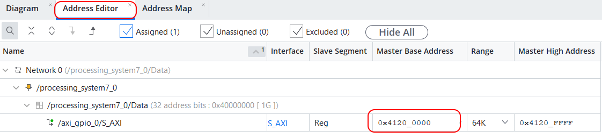
5. Hoặc xem trong tab tên là **Address Map**, theo góc nhìn từ ARM core, lập trình.\
   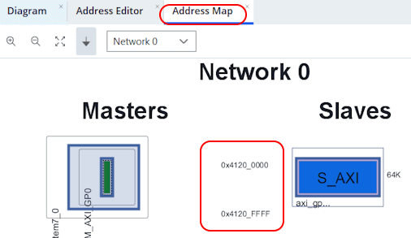

## Kiểm thử và mô phỏng

Chạy Simulation (Mô phỏng) là một bước cực kỳ quan trọng giúp kiểm tra thiết kế. Trong tài liệu này, chỉ tập trung vào kiểm tra thiết kế SoftIP, chứ không liên quan tới phần nối giữa SoftIP và MCU ARM nếu có.

Có 2 cách thực hiện:

1. Sử dụng file [**testbench**](#giả-lập-bằng-file-testbench).
   - Ưu điểm: Cần lập trình verilog. Tương tự như viết Unitest.
   - Nhược điểm: Lâu lúc bắt đầu
2. Can thiệp trực tiếp trên [**waveform**](#giả-lập-bằng-can-thiệp-trực-tiếp-vào-waveform).
    - Ưu điểm: Cực nhanh, trực quan, không cần học cú pháp Verilog Testbench.
    - Nhược điểm: Bấm nút run nhiều lần, không tự động hóa được.

### Giả lập bằng file testbench

1. Tạo **Testbench**: Vào mục **Sources** -> Chuột phải chọn **Add Sources** -> **Add or create simulation sources**.\

2. Tạo một file mới với tên theo convension **tb_.....v**.
3. Viết code giả lập với các Stimulators đẩy vào nguồn.

   ```Verilog
   `timescale 1ns / 1ps      // Bước nhảy 1 ns, độ phân ly tính toán/chính xác là 1ps

   module tb_decoder();
       reg [1:0] sw_test;    // Stimulator - Tín hiệu giả lập đầu vào 
       wire [3:0] led_test;  // Stimulator- Tín hiệu quan sát đầu ra

       // Gọi module thực tế vào để kiểm tra, nối module với các Stimulators
       decoder_2to4 uut (
           .sw(sw_test),
           .led(led_test)
       );

       initial begin
           // Tạo bộ dữ liệu cho Stimulators
           sw_test = 2'b00; 
           led_test = 6'b000000;
           #10; 
           sw_test = 2'b01; 
           led_test = 6'b100001;
           #10;
           sw_test = 2'b10; 
           led_test = 6'b010010;
           #10;
           sw_test = 2'b11; 
           led_test = 6'b001100;
           #10;
           $stop; // Dừng mô phỏng
       end
   endmodule
   ```

4. Chạy **Simulation**: Click vào **Run Simulation** -> **Run Behavioral Simulation**.

### Giả lập bằng can thiệp trực tiếp vào waveform

- **Bước 1: Thiết lập Simulation cho Module.**
  - Trong cửa sổ Sources, tìm đến file Verilog cần giả lập. Chuột phải và chọn Set as Top (để Vivado biết đây là đối tượng chính cần mô phỏng). _Không bắt buộc, nhưng sẽ tránh rối loạn trong quá nhiều module đã thiết kế_
  - Nhấn **Run Simulation** -> **Run Behavioral Simulation**.
- **Bước 2: Force giá trị**(Ép tín hiệu)
   Khi cửa sổ Waveform hiện ra, các tín hiệu ban đầu sẽ ở trạng thái "Z" hoặc "X" (chưa xác định).
  - Tại bảng **Scopes** hoặc **Objects**, tìm tín hiệu đầu vào càn giả lập, ví dụ sw[1:0].
  - Chuột phải vào sw[1:0] và chọn **Force Constant**.
  - Trong ô **Value**, nhập giá trị nhị phân (ví dụ: 00). Nhấn **OK**.
- **Bước 3: Chạy mô phỏng (Step)**
  - Trên thanh công cụ mô phỏng, tìm ô thời gian (mặc định là 10us) và nhấn nút Run for... (biểu tượng mũi tên và đồng hồ cát).
  - Quan sát tín hiệu đầu ra, ví dụ led[3:0], và xem nó đổi giá có đúng không.
  - Nhấn nút **Run for**... một lần nữa.

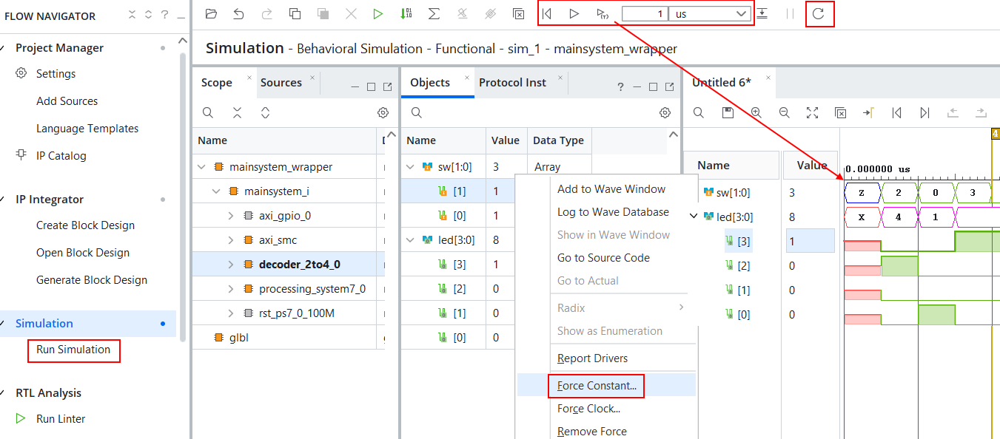

## IO Planner - Gán chân Pin của SofIP với chân Pin vật lý

1. Thiết kế bằng **HDL** hoặc **Block Design** (sau đó phải sinh mã **HDL**)
2. Ở thành left side bar **FLOW NAVIGATOR** / mục **Synthesis**, bấm **Run Synthesis** để Vivado biết các chân Pin của SoftIP.\**
3. Trong quá trình tổng hợp, các mục **Open synthesized Design** sẽ bị bôi xám. Đợi vài phút.
4. Sau khi tổng hợp xong, bấm **Open synthesized Design**
5. Trên thanh công cụ phía trên cùng, hãy đổi Layout từ **Default** sang **I/O Planning**.
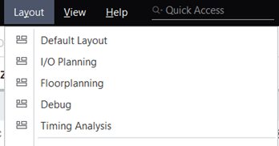
6. Trên màn hình **I/O Ports**, ở bảng bên dưới sẽ thấy danh sách các chân pin của SoftIP đã được **Make External** trước đó trong **Block Design**, như trong ảnh minh họa là rgb_leds, sw_inputs.
   - Ở cột **Package Pin**, gõ tên chân (ví dụ: L15) hoặc chọn từ menu thả xuống.
   - Ở cột **I/O Standard**, chọn mức điện áp phù hợp. Ví dụ LVCMOS33.
   > Sau khi chọn, các chân trên hình ảnh con chip ở giữa màn hình sáng lên khi gán đúng.
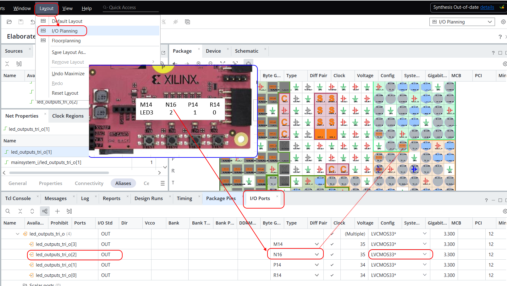
7. Lưu file **.xdc**.
